## Grocery Store Application

Welcome to the Grocery Store Application! This application allows users to browse and purchase groceries online.

## Table of Contents
- [Overview](#overview)
- [Features](#features)
- [Installation](#installation)
- [Development Server](#development-server)
- [Code Scaffolding](#code-scaffolding)
- [Build](#build)
- [Running Unit Tests](#running-unit-tests)
- [Running End-to-End Tests](#running-end-to-end-tests)
- [Further Help](#further-help)
- [Contributing](#contributing)
- [License](#license)

## Overview
The Grocery Store Application is a web-based platform that provides a convenient way for customers to order groceries from the comfort of their homes. It offers a wide selection of products, organized into various categories, with detailed product information and pricing.

## Features
- Api List 
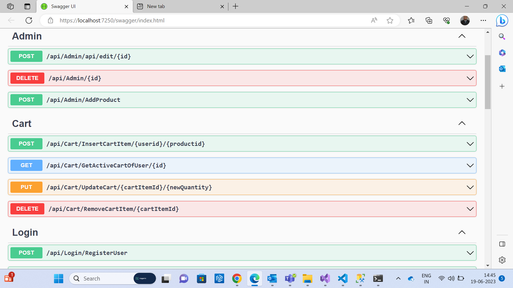
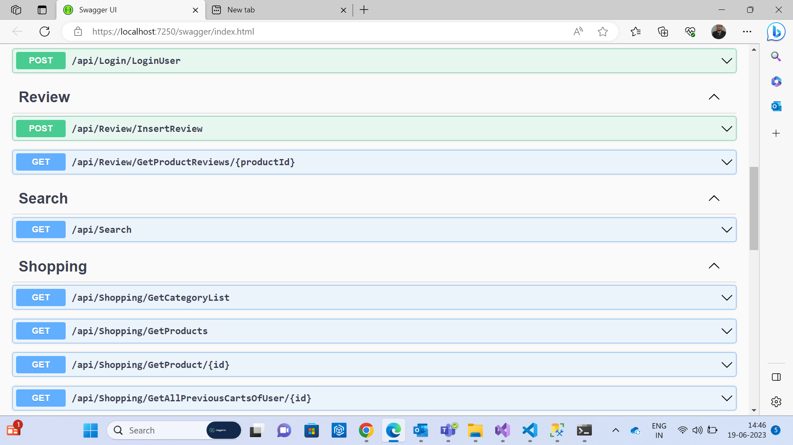
- Dashboard 
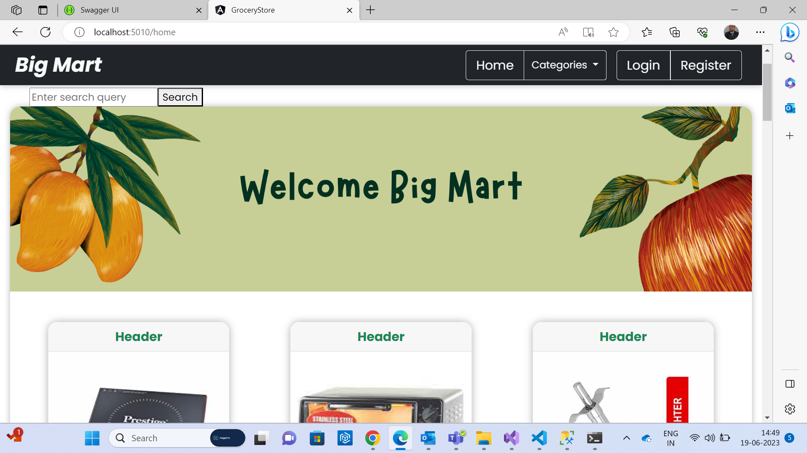
- Browse and search for groceries by category, keywords, or brand
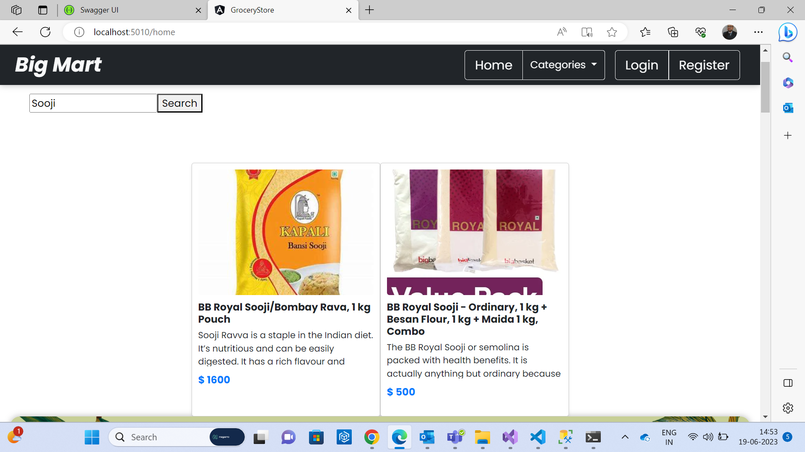

- View detailed product information, including images, descriptions, and pricing
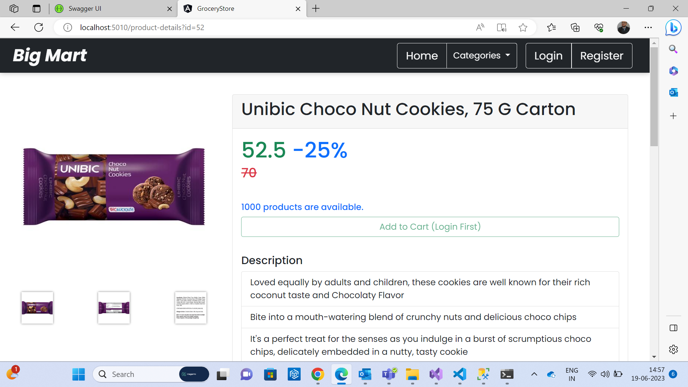

- Add products to the shopping cart and proceed to checkout
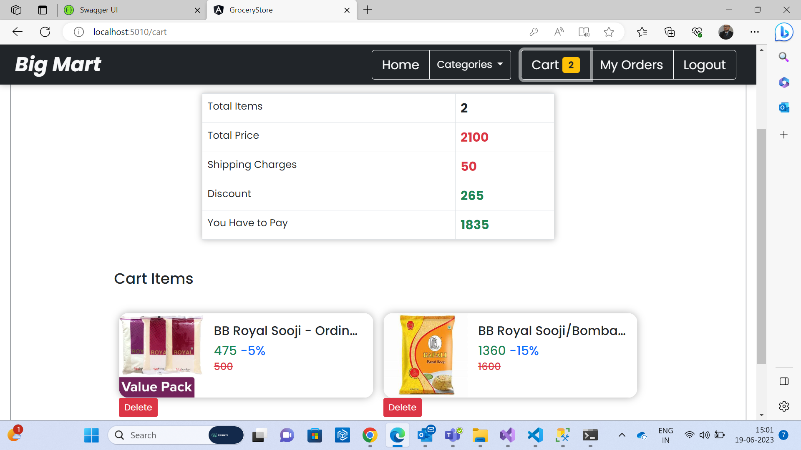
- Apply discounts and promotional offers
- Manage user accounts, including registration and login
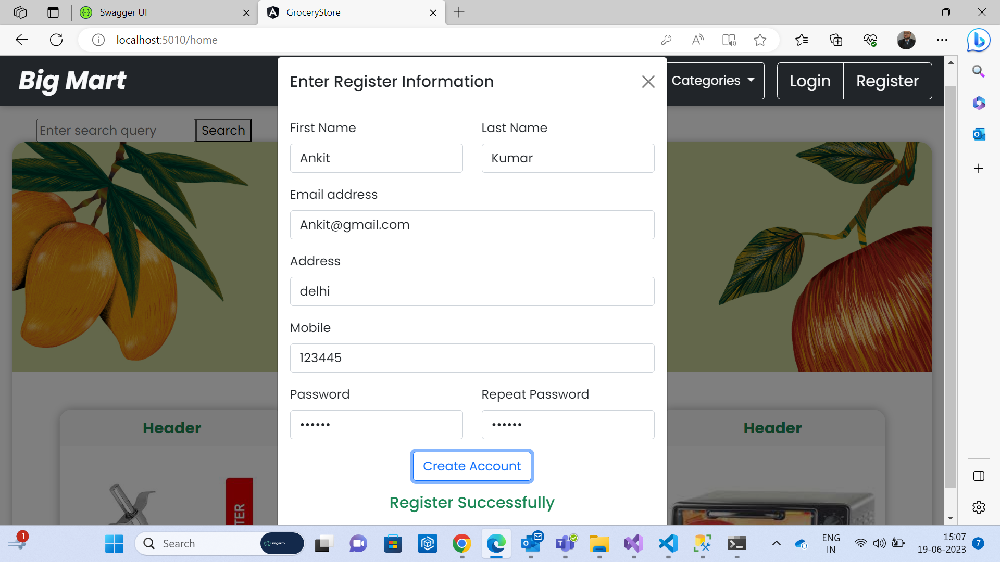
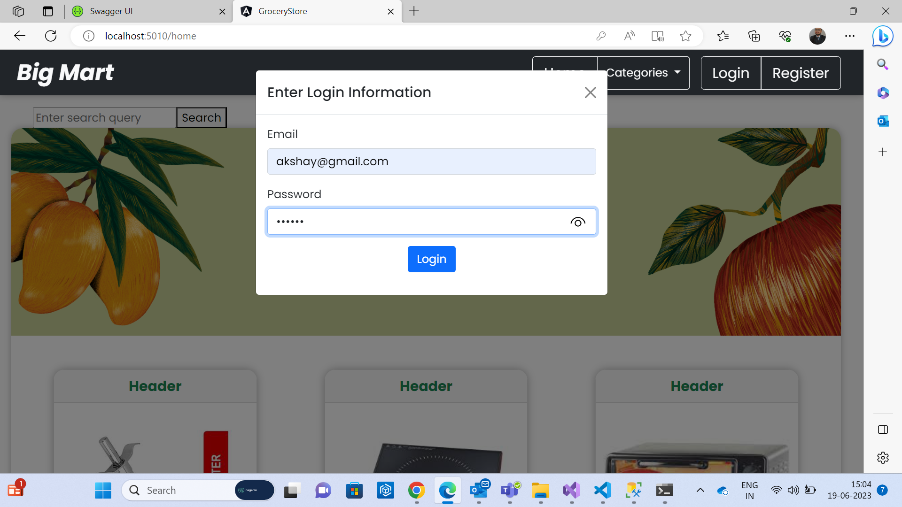

- Check your past order details
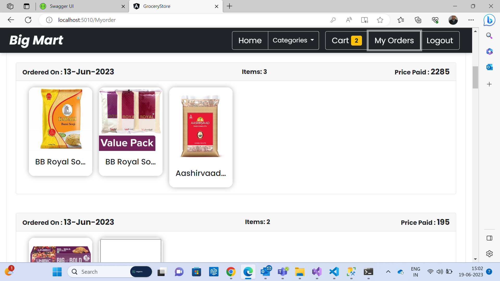
- Admin can perform CRUD operations on products and categories
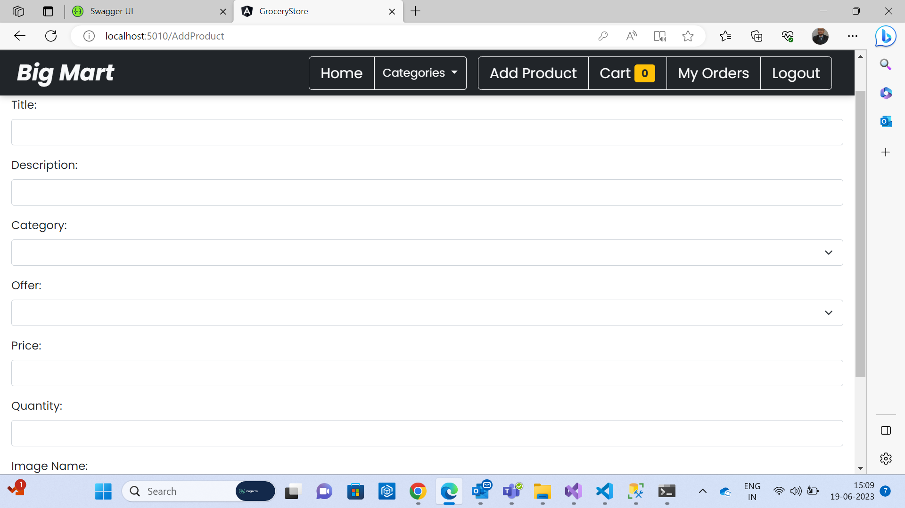
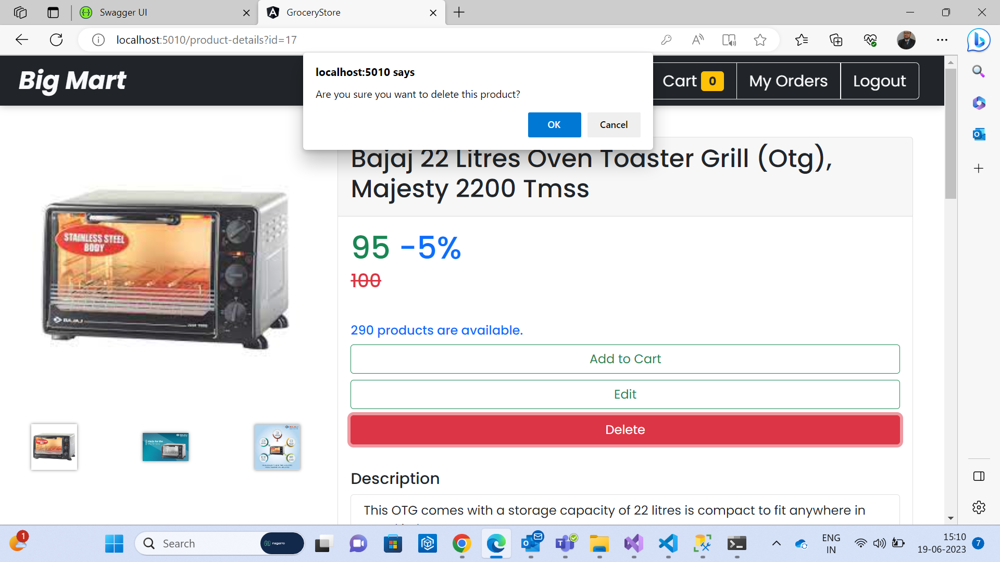
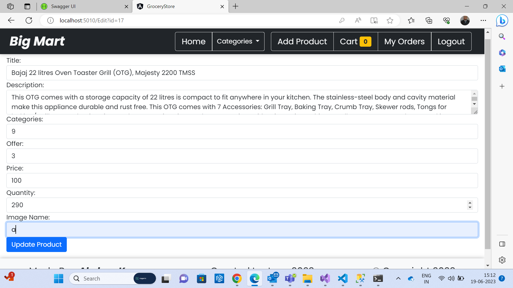
- User Review 

## Installation
To run the Grocery Store Application on your local machine, follow these steps:

1. Download the zip folder and unzip it.
2. Open the `GroceryStoreProject` folder in Visual Studio 2022 and run the application.
3. `GroceryStoreProject` support Asp.net 6 .
4. Open the `GroceryStoreUI` folder in Visual Studio Code.
5. In the terminal, navigate to the `GroceryStoreUI` folder using the command: `cd GroceryStoreUI`.
6. Run the following commands:
   - `npm install --save-dev`
   - `ng serve`
7. The application will start running at `http://localhost:5010/`.
8. The Api host will start running at `http://localhost:4250/api`.

Before running the application, ensure that you have Microsoft SQL Server Management Studio installed. Create a database named `GroceryStore` and 
run the schema Script
and data scripts 
provided in the `GroceryStoreProject` folder.

## Development Server
To run the development server, use the following command:

shell
ng serve

Navigate to `http://localhost:5010/`. The application will automatically reload if you change any of the source files.

## Code Scaffolding
Use the Angular CLI to generate components, directives, pipes, services, classes, guards, interfaces, enums, or modules. 

Use the following command syntax:

shell
ng generate component component-name

For example, to generate a new component, run:

shell
ng generate component my-component

## Build
To build the project, run the following command:

shell
ng build

The build artifacts will be stored in the `dist/` directory.

## Running Unit Tests
To execute the unit tests via Karma, run the following command:

shell
ng test

## Running End-to-End Tests
To execute the end-to-end tests via a platform of your choice, use the following command:

shell
ng e2e

Before running end-to-end tests, you need to add a package that implements end-to-end testing capabilities.

## Further Help
For more help on the Angular CLI, use the following command:

shell
ng help

You can also refer to the [Angular CLI Overview and Command Reference](https://angular.io/cli) page.